```mermaid
flowchart LR
    A[Push to Branch] --> B[Code Format Check]
    B --> C[Prettier]
    C --> D[Linting]
    D --> E[Unit Tests]
    E --> F[Integration Tests]
    F --> G[E2E Tests]
    G --> H[Smoke Tests]
    H --> I[Dev Build]
    I --> J{All Checks Pass?}
    J -->|Yes| K[✅ Success]
    J -->|No| L[❌ Fix Required]
    
    style A fill:#e1f5ff
    style K fill:#d4edda
    style L fill:#f8d7da
```

```mermaid
flowchart TD
    A[PR Created: dev → main] --> B{Manual Review Only}
    B --> C[Code Review]
    C --> D[Approval Required]
    D -->|Approved| E[Ready to Merge]
    D -->|Changes Requested| F[Back to dev]
    
    style A fill:#fff4e6
    style E fill:#d4edda
    style F fill:#f8d7da
```

# CI/CD and Release Process Documentation

## Overview

This document describes the CI/CD pipeline and release process for our multi-technology codebase (Python, JavaScript, SQL, dbt, Terraform) using GitHub Actions and Semantic Release.

## Branch Strategy

### Protected Branches

- **`main`**: Production release branch
- **`dev`**: Pre-release branch for development
- **`release/v*`**: Release snapshot branches for hotfixes and maintenance

### Branch Protection Rules

- ✅ Merge to `main` only from `dev`
- ✅ No direct pushes to protected branches (PR-only)
- ✅ No force pushes (except automated CI pushes like CHANGELOG updates)
- ✅ CI automated commits use `[ci skip]` to prevent recursive builds
- ✅ **Required reviewers**: At least 2 approvals required for PRs to `main`
- ✅ **Required reviewers**: At least 1 approval required for PRs to `dev`
- ✅ **Code owners**: Automatic reviewer assignment based on CODEOWNERS file
- ✅ **Dismiss stale reviews**: Re-approval required after new commits
- ✅ **Require branches to be up to date**: Must merge latest changes before merging PR

## Versioning Strategy

Using **Semantic Versioning** (semver) with the following format:

- **Production releases**: `v1.2.3`
- **Pre-releases**: `v1.2.4-dev.2`
- **Major tags**: `latest`, `v1`, `v2`, etc.

## CI/CD Pipeline Overview


## Detailed Pipeline Stages

### 1. Feature/Fix Branch Push

**Trigger**: Push to any `feature/*` or `fix/*` branch

**Pipeline Steps**:



**Actions**:
- ✅ Code formatting validation
- ✅ Prettier checks
- ✅ Linting (Python, JS, SQL)
- ✅ Unit tests
- ✅ Integration tests
- ✅ End-to-end (E2E) tests
- ✅ Smoke tests
- ✅ Development build validation

---

### 2. Pull Request to `dev`

**Trigger**: PR created from `feature/*` or `fix/*` to `dev`

**Pipeline Steps**:


**Actions**:
1. **Semantic Release Dry Run**:
   - Calculate `next-version`
   - Determine `next-release-bool` (will there be a release?)
   - Calculate `major-version`
   - Determine `major-release-bool` (is this a major bump?)

2. **Code Deploy CI Check**:
   - Validate artifactory configuration
   - Check deployment permissions
   - Output build artifacts list

3. **Infrastructure Plan**:
   - Run `terraform plan`
   - Output infrastructure changes

4. **PR Comment/Description Update**:
   - Add all outputs to PR as a comment
   - Include version information
   - Include deployment plan
   - Include infrastructure changes

---

### 3. Push to `dev` Branch

**Trigger**: PR merged to `dev`

**Pipeline Steps**:


**Actions**:
1. **Semantic Release**:
   - Analyze commits since last release
   - Generate pre-release version (e.g., `v1.2.3-dev.1`)
   - Create pre-release Git tag
   - Create GitHub release record (marked as pre-release)
   - Update `CHANGELOG.md` with `[ci skip]` commit message

2. **Build & Deploy Artifacts**:
   - Build Python packages → Deploy to PyPI/Artifactory
   - Build npm packages → Deploy to npm registry
   - Build Docker images → Deploy to Docker registry
   - Upload additional artifacts to Artifactory

3. **Deploy Infrastructure to DEV**:
   - Run `terraform apply` for DEV environment
   - Deploy dbt models to DEV
   - Use artifacts from previous step

---

### 4. Pull Request from `dev` to `main`

**Trigger**: PR created from `dev` to `main`

**Pipeline Steps**:



**Actions**:
- **No automated preliminary checks** (checks only run on PRs to `dev`)
- Manual code review required
- Focus on production readiness review
- Requires at least 2 approvals (recommended)
- Review changelog and release notes from DEV deployment

---

### 5. Merge to `main` Branch

**Trigger**: PR merged from `dev` to `main`

**Pipeline Steps - Production Release and Deployment**:

```mermaid
flowchart TD
    A[Merge to main] --> B[Run Semantic Release]
    B --> C[Create Production Version]
    C --> D[Create Production Tag]
    D --> E[Create GitHub Release]
    E --> F[Update CHANGELOG.md]
    F -->|"[ci skip]"| G[Commit CHANGELOG]
    G --> H[Deploy Infrastructure to PROD]
    H --> I[Terraform Apply PROD]
    I --> J[dbt Deploy PROD]
    J --> K{Deployment Success?}
    K -->|Yes| L[✅ PROD Deployment Complete]
    K -->|No| M[❌ Rollback & Alert]
    
    style A fill:#e8f5e9
    style C fill:#d4edda
    style L fill:#d4edda
    style M fill:#f8d7da
```



**Actions**:
1. **Semantic Release**:
   - Analyze commits since last production release
   - Generate production version (e.g., `v1.2.3`)
   - Create production Git tag
   - Create GitHub release record (production release)
   - Update `CHANGELOG.md` with `[ci skip]` commit message

2. **Deploy Infrastructure to PROD**:
   - Use artifacts built during DEV deployment (environment agnostic)
   - Apply environment-specific configuration via config files
   - Run `terraform apply` for PROD environment
   - Deploy dbt models to PROD
   - No rebuild needed (promote DEV artifacts)

---

### 6. Main Major Release Pipeline

**Trigger**: After merge to `main` is complete **AND** a major version bump is detected

**Pipeline Steps**:


**Actions**:
1. **Check for Major Version Bump**:
   - Only run if semantic release created a major version (e.g., `v1.0.0`, `v2.0.0`)
   - Skip snapshot creation for minor and patch releases

2. **Create Release Snapshot Branch** (only for major releases):
   - Branch naming: `release/v1`, `release/v2`, etc.
   - Based on major version tag
   - Used for future hotfixes and maintenance
   - Snapshot of production state at major release

---

### 7. Push to `release/v*` Branch (Hotfixes)

**Trigger**: Push to any `release/v*` branch

**Pipeline Steps**:


**Actions**:
1. **Hotfix Development**:
   - Same as push to `dev` pipeline
   - Creates pre-release version from snapshot (e.g., `v1.2.3-hotfix.1`)
   - Deploys to DEV environment for testing
   - Allows isolated hotfix development

2. **Hotfix Merge Strategy**:
   - Cherry-pick hotfix commits from `release/v*` to `dev`
   - Test in DEV environment
   - Create PR from `dev` to `main`
   - Merge to `main` triggers production deployment
   - This ensures hotfixes go through the standard release flow

---

## Environment Flow


**Note**: Artifacts are built once in DEV and promoted to PROD. Environment-specific configuration is applied during deployment via config files.

## Technology Stack

### Codebase Technologies
- **Python**: Backend services, data processing
- **JavaScript**: Frontend applications, tooling
- **SQL**: Database queries and migrations
- **dbt**: Data transformation and analytics
- **Terraform**: Infrastructure as Code (IaC)

### CI/CD Technologies
- **GitHub Actions**: CI/CD orchestration
- **Semantic Release**: Automated versioning and releases
- **Artifactory**: Artifact storage
- **Package Registries**: PyPI, npm, Docker Hub

---

## Semantic Release Configuration

### Commit Message Format

Using **Conventional Commits** specification:

```
<type>(<scope>): <subject>

<body>

<footer>
```

### Commit Types & Version Bumps

| Commit Type | Description | Version Bump |
|-------------|-------------|--------------|
| `fix:` | Bug fixes | PATCH (0.0.x) |
| `feat:` | New features | MINOR (0.x.0) |
| `BREAKING CHANGE:` | Breaking API changes | MAJOR (x.0.0) |
| `docs:` | Documentation only | No release |
| `style:` | Code style changes | No release |
| `refactor:` | Code refactoring | No release |
| `perf:` | Performance improvements | PATCH (0.0.x) |
| `test:` | Test additions/changes | No release |
| `chore:` | Build/tooling changes | No release |

### Example Commits

```bash
# Patch release (v1.2.3 → v1.2.4)
fix(api): resolve authentication timeout issue

# Minor release (v1.2.3 → v1.3.0)
feat(dashboard): add real-time analytics widget

# Major release (v1.2.3 → v2.0.0)
feat(api): redesign user authentication system

BREAKING CHANGE: The authentication endpoint now requires OAuth 2.0 instead of API keys
```

---

## PR Comment Template

When a PR is created, the following information is automatically added as a comment:

```markdown
## 🚀 Release Information

**Next Version**: `v1.3.0-dev.1`
**Release Type**: Minor (feat)
**Next Major Version**: `v1`
**Major Release**: No

## 📦 Deployment Plan

### Artifacts to be built:
- `my-service:v1.3.0-dev.1` (Docker)
- `my-package@1.3.0-dev.1` (npm)
- `my-python-package==1.3.0.dev1` (PyPI)

### Permissions Check:
✅ Artifactory: Write access confirmed
✅ npm Registry: Publish access confirmed
✅ PyPI: Upload access confirmed

## 🏗️ Infrastructure Changes

### Terraform Plan Output:

\`\`\`terraform
Terraform will perform the following actions:

  # aws_lambda_function.api will be updated in-place
  ~ resource "aws_lambda_function" "api" {
      ~ memory_size = 512 -> 1024
        # (10 unchanged attributes hidden)
    }

Plan: 0 to add, 1 to change, 0 to destroy.
\`\`\`

### dbt Changes:
- Modified models: 3
- New models: 1
- Deprecated models: 0
```

---

## Rollback Strategy

### Using Release Snapshots

1. **Identify the snapshot**: Use `release/v*` branches (created at major releases)
2. **Create hotfix branch**: Branch from appropriate `release/v*`
3. **Apply fix**: Make necessary changes
4. **Test in DEV**: Deploy from `release/v*` to DEV
5. **Cherry-pick to dev**: Cherry-pick hotfix commits to `dev` branch
6. **Test in DEV again**: Verify in dev environment
7. **Deploy to PROD**: Create PR from `dev` to `main` and merge

### Emergency Rollback Process

```bash
# Step 1: Revert to previous release snapshot
git checkout release/v1
git checkout -b hotfix/emergency-rollback
git revert <problematic-commit-sha>
git push origin release/v1

# Step 2: Pipeline will automatically deploy to DEV for testing

# Step 3: Cherry-pick to dev
git checkout dev
git cherry-pick <revert-commit-sha>
git push origin dev

# Step 4: Test in DEV, then create PR to main

# Step 5: Merge PR - triggers production deployment
```

### Automated Rollback Triggers

**Health Check Failures**:
- Monitor critical metrics post-deployment
- Automatic rollback if health checks fail
- Alert team immediately

**Rollback Criteria**:
1. **Critical errors** increase by >50% in first 5 minutes
2. **Response time** increases by >100% compared to baseline
3. **Success rate** drops below 95%
4. **Database connection** failures exceed threshold

**Rollback Process**:


**Post-Rollback Actions**:
1. Create incident report
2. Analyze root cause
3. Create hotfix following standard process
4. Update monitoring thresholds if needed

---

## Best Practices

### ✅ DO

- Write meaningful commit messages following Conventional Commits
- Create PRs with descriptive titles and descriptions
- Review semantic release dry-run output in PRs
- Test thoroughly in DEV before merging to main
- Use `release/v*` branches for hotfixes
- Keep CHANGELOG.md updated (automated)

### ❌ DON'T

- Force push to protected branches
- Merge directly to main (except from dev)
- Skip CI checks
- Use `[ci skip]` in feature commits (reserved for automation)
- Create manual releases or tags
- Modify CHANGELOG.md manually

---

## Monitoring & Notifications

### Pipeline Status

Monitor pipeline status through:
- GitHub Actions dashboard
- PR checks and comments
- GitHub release pages

### Failed Deployments

In case of failures:
1. Check GitHub Actions logs
2. Review terraform plan output
3. Verify artifact registry access
4. Check infrastructure state
5. Rollback if necessary using snapshot branches

---

## Troubleshooting

### Common Issues

#### Issue: Semantic release not creating a version

**Solution**: Ensure commits follow Conventional Commits format with types that trigger releases (`fix:`, `feat:`, `BREAKING CHANGE:`)

#### Issue: Terraform plan fails on PR

**Solution**: 
- Verify Terraform syntax
- Check AWS credentials/permissions
- Ensure state file is accessible

#### Issue: Artifact deployment fails

**Solution**:
- Verify registry credentials
- Check network connectivity
- Ensure proper permissions in Artifactory/registries

#### Issue: `[ci skip]` not working

**Solution**: Ensure exact format with brackets and lowercase

---

## Workflow Diagrams

### Complete Release Flow


### Hotfix Flow

```mermaid
flowchart TD
    A[Production Issue Detected] --> B[Identify Major Version]
    B --> C[Checkout release/v* Branch]
    C --> D[Create Hotfix Branch]
    D --> E[Apply Fix]
    E --> F[Push to release/v*]
    F --> G[Semantic Release - Pre-release]
    G --> H[Deploy to DEV]
    H --> I{Testing Passed?}
    I -->|No| E
    I -->|Yes| J[Cherry-pick to dev]
    J --> K[Test in DEV]
    K --> L{DEV Tests Pass?}
    L -->|No| E
    L -->|Yes| M[Create PR: dev → main]
    M --> N[Merge to main]
    N --> O[Semantic Release - Production]
    O --> P[Deploy to PROD]
    P --> Q[Hotfix Complete]
    
    style A fill:#f8d7da
    style H fill:#fff3cd
    style K fill:#fff3cd
    style P fill:#d4edda
    style Q fill:#d4edda
```



---

## Security Considerations

### Branch Protection
- ✅ Require pull request reviews before merging (2 for `main`, 1 for `dev`)
- ✅ Require status checks to pass before merging
- ✅ Restrict who can push to matching branches
- ✅ Require signed commits (recommended)
- ✅ Use CODEOWNERS file for automatic reviewer assignment
- ✅ Dismiss stale reviews when new commits are pushed

### Secrets Management
- ✅ Store credentials in GitHub Secrets
- ✅ Use environment-specific secrets (DEV, PROD)
- ✅ Rotate credentials regularly
- ✅ Never commit secrets to repository
- ✅ Use secret scanning to prevent accidental commits
- ✅ Implement least-privilege access for service accounts

### Access Control
- ✅ Limit write access to protected branches
- ✅ Use GitHub Teams for permission management
- ✅ Audit access logs regularly
- ✅ Implement least-privilege principle
- ✅ Separate DEV and PROD deployment permissions

---

## Architecture Decisions

### Key Design Decisions:

1. **✅ Semantic Release on Main**: Production releases are created when merging to `main`, generating versions like `v1.2.3`

2. **✅ Artifact Reuse**: PROD deployments reuse artifacts from DEV deployment (artifacts are environment-agnostic; environment-specific configuration is managed via config files)

3. **✅ Hotfix Merge Strategy**: Hotfixes follow this path:
   - Develop on `release/v*` → Deploy to DEV for testing
   - Cherry-pick to `dev` → Test in DEV again
   - Create PR from `dev` to `main` → Merge triggers production deployment

4. **✅ PR Checks Scope**: Preliminary automated checks (semantic release dry run, terraform plan, etc.) run **only on PRs to `dev`**. PRs to `main` require manual review only.

5. **✅ Snapshot Creation Trigger**: Release snapshot branches (`release/v*`) are created **only on major version bumps** (e.g., `v1.0.0` → `v2.0.0`), not on every merge to main.

### Rationale:

- **Environment-agnostic artifacts**: Promotes consistency and speed; same artifacts tested in DEV are deployed to PROD
- **Hotfix flow through dev**: Ensures all changes go through standard testing and review process
- **No PR checks on main**: DEV is the quality gate; main PRs focus on production readiness review
- **Snapshots on major versions only**: Reduces branch sprawl while maintaining hotfix capability for major releases

---

## Appendix

### Useful Commands

```bash
# Check semantic release dry run locally
npx semantic-release --dry-run

# View release history
git tag -l -n9

# Check current version
git describe --tags --abbrev=0

# Create a hotfix branch from snapshot
git checkout -b hotfix/critical-fix release/v1
```

### Configuration Files

#### `.releaserc.json` (Semantic Release)
```json
{
  "branches": [
    "main",
    {
      "name": "dev",
      "prerelease": "dev"
    },
    {
      "name": "release/v+([0-9])?(.{+([0-9]),x}).x",
      "prerelease": "hotfix"
    }
  ],
  "plugins": [
    "@semantic-release/commit-analyzer",
    "@semantic-release/release-notes-generator",
    "@semantic-release/changelog",
    [
      "@semantic-release/git",
      {
        "message": "chore(release): ${nextRelease.version} [ci skip]\n\n${nextRelease.notes}"
      }
    ],
    "@semantic-release/github"
  ]
}
```

#### `CODEOWNERS` (Required Reviewers)
```
# Default owners for everything
*                           @devops-team

# Python code
*.py                        @python-team @devops-team
requirements.txt            @python-team

# JavaScript/TypeScript
*.js *.ts *.jsx *.tsx       @frontend-team @devops-team
package.json                @frontend-team

# Infrastructure
*.tf                        @infra-team @devops-team
*.tfvars                    @infra-team

# dbt
models/                     @data-team @devops-team
*.sql                       @data-team

# CI/CD
.github/workflows/          @devops-team
.releaserc.json             @devops-team

# Critical production files (require additional review)
terraform/prod/             @infra-team @devops-team @security-team
```

#### Example GitHub Actions Workflow Structure
```yaml
name: CI/CD Pipeline

on:
  push:
    branches:
      - 'feature/**'
      - 'fix/**'
      - 'dev'
      - 'main'
      - 'release/v*'
  pull_request:
    branches:
      - 'dev'  # Only automated checks on PRs to dev

jobs:
  code-ci:
    name: Code Quality Checks
    if: startsWith(github.ref, 'refs/heads/feature/') || startsWith(github.ref, 'refs/heads/fix/')
    runs-on: ubuntu-latest
    steps:
      - name: Checkout
        uses: actions/checkout@v3
      - name: Format Check
        run: make format-check
      - name: Prettier
        run: make prettier-check
      - name: Lint
        run: make lint
      - name: Unit Tests
        run: make test-unit
      - name: Integration Tests
        run: make test-integration
      - name: E2E Tests
        run: make test-e2e
      - name: Smoke Tests
        run: make test-smoke
      - name: Dev Build
        run: make build-dev
  
  preliminary-checks:
    name: PR Preliminary Checks
    if: github.event_name == 'pull_request' && github.base_ref == 'dev'
    runs-on: ubuntu-latest
    steps:
      - name: Semantic Release Dry Run
        run: npx semantic-release --dry-run
      - name: Extract Version Info
        id: version
        run: |
          echo "next-version=$(get_next_version)" >> $GITHUB_OUTPUT
          echo "major-version=$(get_major_version)" >> $GITHUB_OUTPUT
      - name: Terraform Plan
        run: terraform plan -out=tfplan
      - name: Artifactory CI Check
        run: make check-artifactory-permissions
      - name: Update PR Comment
        uses: actions/github-script@v6
        with:
          script: |
            // Post results as PR comment
  
  semantic-release-dev:
    name: Semantic Release (DEV)
    if: github.ref == 'refs/heads/dev' && github.event_name == 'push'
    runs-on: ubuntu-latest
    steps:
      - name: Semantic Release
        run: npx semantic-release
  
  semantic-release-main:
    name: Semantic Release (PROD)
    if: github.ref == 'refs/heads/main' && github.event_name == 'push'
    runs-on: ubuntu-latest
    steps:
      - name: Semantic Release
        run: npx semantic-release
  
  build-deploy-dev:
    name: Build & Deploy to DEV
    if: github.ref == 'refs/heads/dev' || startsWith(github.ref, 'refs/heads/release/v')
    needs: [semantic-release-dev]
    runs-on: ubuntu-latest
    steps:
      - name: Build Artifacts
        run: make build-all
      - name: Deploy to PyPI
        run: make deploy-pypi-dev
      - name: Deploy to npm
        run: make deploy-npm-dev
      - name: Deploy to Docker Registry
        run: make deploy-docker-dev
      - name: Deploy Infrastructure
        run: make deploy-infra-dev
  
  deploy-prod:
    name: Deploy to PROD
    if: github.ref == 'refs/heads/main' && github.event_name == 'push'
    needs: [semantic-release-main]
    runs-on: ubuntu-latest
    steps:
      - name: Deploy Infrastructure (using DEV artifacts)
        run: make deploy-infra-prod
      - name: Health Checks
        run: make health-check-prod
      - name: Automated Rollback on Failure
        if: failure()
        run: make rollback-prod
  
  major-release-snapshot:
    name: Create Major Release Snapshot
    if: github.ref == 'refs/heads/main' && github.event_name == 'push'
    needs: [deploy-prod]
    runs-on: ubuntu-latest
    steps:
      - name: Check if Major Release
        id: check-major
        run: |
          IS_MAJOR=$(check_if_major_release)
          echo "is-major=$IS_MAJOR" >> $GITHUB_OUTPUT
      - name: Create Snapshot Branch
        if: steps.check-major.outputs.is-major == 'true'
        run: |
          MAJOR_VERSION=$(get_major_version)
          git checkout -b release/v${MAJOR_VERSION}
          git push origin release/v${MAJOR_VERSION}
```

---

## Changelog

This documentation should be kept in sync with the actual CI/CD implementation. For changes to the release process, update this document and create an ADR (Architecture Decision Record).

---

**Last Updated**: November 24, 2025  
**Version**: 1.0.0  
**Maintained by**: DevOps Team

