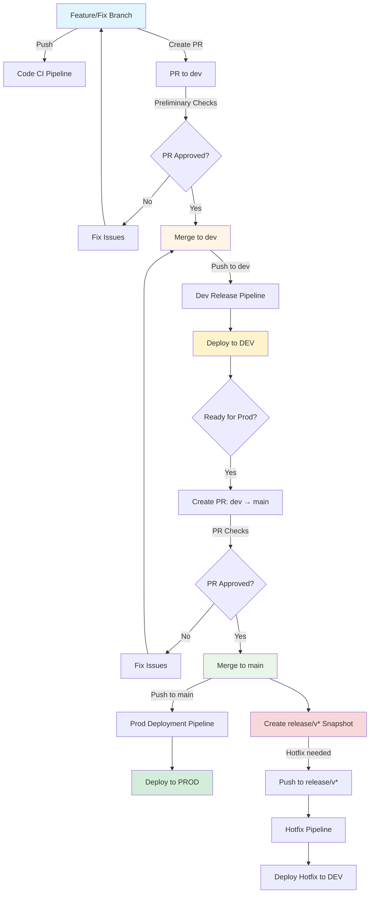

## CI/CD Pipeline Overview

```mermaid
flowchart TD
    A[Feature/Fix Branch] -->|Push| B[Code CI Pipeline]
    A -->|Create PR| C[PR to dev]
    C -->|Preliminary Checks| D{PR Approved?}
    D -->|No| E[Fix Issues]
    E --> A
    D -->|Yes| F[Merge to dev]
    F -->|Push to dev| G[Dev Release Pipeline]
    G --> H[Deploy to DEV]
    H --> I{Ready for Prod?}
    I -->|Yes| J[Create PR: dev → main]
    J -->|PR Checks| K{PR Approved?}
    K -->|No| L[Fix Issues]
    L --> F
    K -->|Yes| M[Merge to main]
    M -->|Push to main| N[Prod Deployment Pipeline]
    N --> O[Deploy to PROD]
    M --> P[Create release/v* Snapshot]
    P -->|Hotfix needed| Q[Push to release/v*]
    Q --> R[Hotfix Pipeline]
    R --> S[Deploy Hotfix to DEV]
    
    style A fill:#e1f5ff
    style F fill:#fff4e6
    style M fill:#e8f5e9
    style H fill:#fff3cd
    style O fill:#d4edda
    style P fill:#f8d7da
```