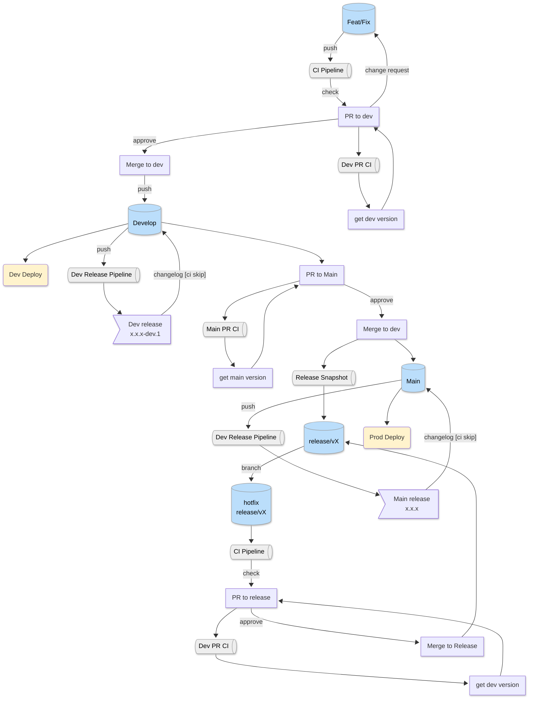

## CI/CD Pipeline Overview

```mermaid
---
config:
  look: neo
  layout: fixed
---
flowchart TB
    n1["Develop"] --> H["Dev Deploy"] & n10["PR to Main"]
    n1 -- push --> n2["Dev Release Pipeline"]
    A["Feat/Fix"] -- push --> A1["CI Pipeline"]
    A1 -- check --> C["PR to dev"]
    n2 --> n12>"Dev release<br>x.x.x-dev.1"]
    n12 -- changelog [ci skip] --> n1
    C --> n3["Dev PR CI"]
    C -- approve --> n16@{ label: "<span style=\"padding-left:\">Merge to dev</span>" }
    C -- change request --> A
    n13["get dev version"] --> C
    n3 --> n13
    n10 --> n14["Main PR CI"]
    n10 -- approve --> n18@{ label: "<span style=\"padding-left:\">Merge to dev</span>" }
    n15["get main version"] --> n10
    n14 --> n15
    n16 -- push --> n1
    n18 --> n20["Release Snapshot"] & n29["Main"]
    n20 --> n19["release/vX"]
    n23["CI Pipeline"] -- check --> n24["PR to release"]
    n24 --> n25["Dev PR CI"]
    n24 -- approve --> n26@{ label: "<span style=\"padding-left:\">Merge to Release</span>" }
    n27["get dev version"] --> n24
    n25 --> n27
    n21["hotfix<br>release/vX"] --> n23
    n26 --> n19
    n19 -- branch --> n21
    n29 -- push --> n30["Dev Release Pipeline"]
    n30 --> n31>"Main release<br>x.x.x"]
    n31 -- changelog [ci skip] --> n29
    n29 --> n28["Prod Deploy"]

    n1@{ shape: cyl}
    H@{ shape: rounded}
    n10@{ shape: rect}
    n2@{ shape: h-cyl}
    A@{ shape: cyl}
    A1@{ shape: h-cyl}
    n3@{ shape: h-cyl}
    n16@{ shape: rect}
    n13@{ shape: rect}
    n14@{ shape: h-cyl}
    n18@{ shape: rect}
    n15@{ shape: rect}
    n20@{ shape: h-cyl}
    n29@{ shape: cyl}
    n19@{ shape: cyl}
    n23@{ shape: h-cyl}
    n24@{ shape: rect}
    n25@{ shape: h-cyl}
    n26@{ shape: rect}
    n27@{ shape: rect}
    n21@{ shape: cyl}
    n30@{ shape: h-cyl}
    n28@{ shape: rounded}
     n1:::Ash
     n2:::Ash
     A:::Ash
     A1:::Ash
     n3:::Ash
     n14:::Ash
     n20:::Ash
     n29:::Ash
     n19:::Ash
     n23:::Ash
     n25:::Ash
     n21:::Ash
     n30:::Ash
    classDef Ash stroke-width:1px, stroke-dasharray:none, stroke:#999999, fill:#EEEEEE, color:#000000
    style n1 fill:#BBDEFB
    style H fill:#fff3cd
    style A fill:#BBDEFB
    style n29 fill:#BBDEFB
    style n19 fill:#BBDEFB
    style n21 fill:#BBDEFB
    style n28 fill:#fff3cd
```