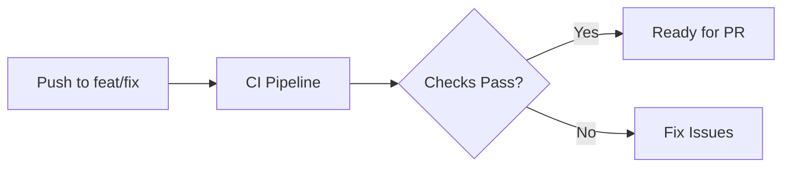
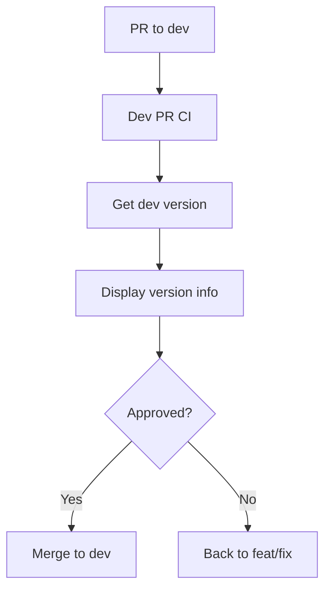
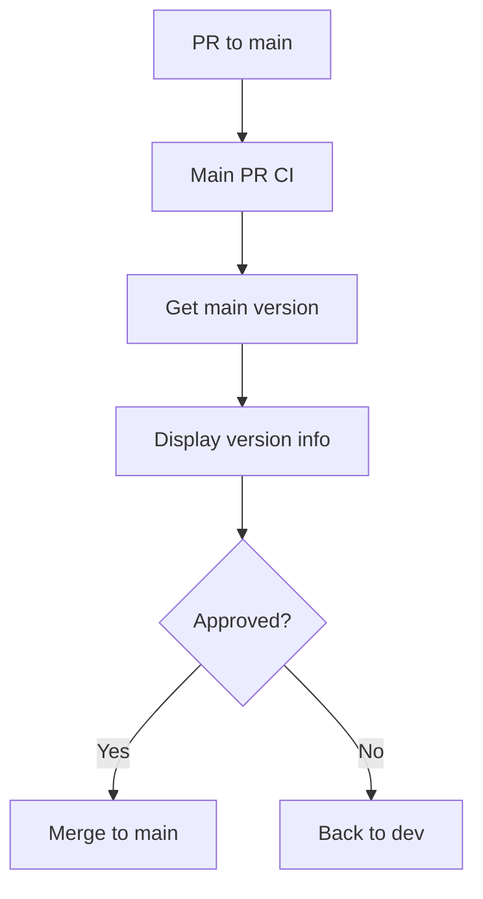
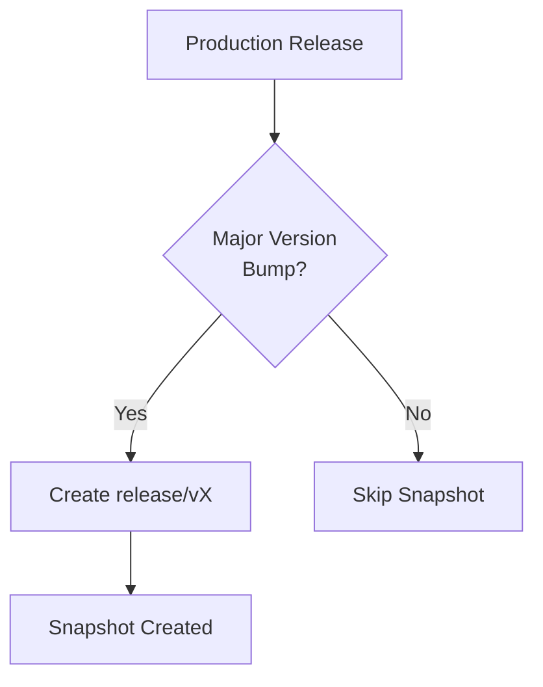
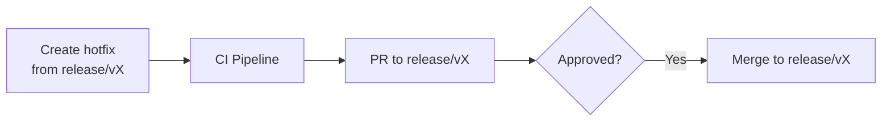
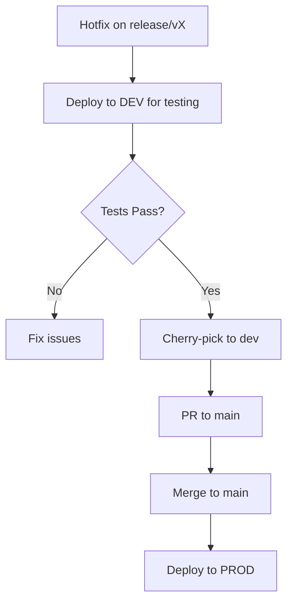

# Pipeline Documentation

## Table of Contents
1. [Overview](#overview)
2. [Branch Strategy](#branch-strategy)
3. [Pipeline Stages](#pipeline-stages)
4. [Development Workflow](#development-workflow)
5. [Release Process](#release-process)
6. [Hotfix Process](#hotfix-process)
7. [Environment Promotion](#environment-promotion)

---

## Overview

This document describes the automated CI/CD pipeline for the project, visualized in the pipeline diagram. The pipeline implements a GitFlow-inspired branching strategy with automated semantic versioning, pre-release testing in DEV, and controlled production deployments.

### Key Characteristics

- **Semantic Versioning**: Automated version management based on commit conventions
- **Pre-release Testing**: All changes deployed to DEV before production
- **Release Snapshots**: Major versions create `release/v*` branches for hotfix support
- **Deployment Automation**: Triggered by branch merges with automated checks

---

## Branch Strategy

### Primary Branches

| Branch | Purpose | Versioning | Deployment Target |
|--------|---------|------------|-------------------|
| `develop` (dev) | Integration branch for features | `x.x.x-dev.N` pre-releases | DEV environment |
| `main` | Production release branch | `x.x.x` stable releases | PROD environment |
| `release/vX` | Snapshot branches for hotfixes | `x.x.x` with cherry-pick | DEV → PROD |
| `feat/*`, `fix/*` | Feature/fix development branches | No versioning | No deployment |

### Branch Flow

```
feat/fix → dev → main
                  ↓
              release/vX (on major releases)
                  ↓
              hotfix → dev → main
```

---

## Pipeline Stages

### 1. Feature/Fix Development (`feat/*`, `fix/*`)

**Trigger**: Push to feature or fix branch

**Actions**:
- Run CI Pipeline (code quality checks, linting, tests)
- Validate code before creating PR to `dev`

**No deployment or versioning occurs at this stage.**



---

### 2. Pull Request to `dev`

**Trigger**: PR opened from `feat/*` or `fix/*` to `dev`

**Pipeline**: `Dev PR CI`

**Actions**:
1. **Semantic Release Dry Run**: Calculate next version
   - `next-version`: What version will be created (e.g., `v1.2.3-dev.1`)
   - `next-release-bool`: Will a release be triggered?
   - `major-version`: Major version tag (e.g., `v1`)
   - `major-release-bool`: Is this a major version bump?

2. **Preliminary Checks**:
   - Code deploy CI check
   - Artifactory permissions validation
   - Build artifact list generation

3. **PR Comment Update**:
   - Post version information to PR
   - Show what will be released on merge

**Outputs**: Version information displayed in PR comment

**Approval Required**: At least 1 reviewer



---

### 3. Merge to `dev` - Development Release

**Trigger**: PR merged to `dev` branch

**Pipeline**: `Dev Release Pipeline`

**Actions**:
1. **Semantic Release**:
   - Create pre-release version (e.g., `v1.2.3-dev.1`)
   - Generate GitHub pre-release
   - Update CHANGELOG.md with `[ci skip]` commit

2. **Deployment to DEV**:
   - Build and deploy artifacts
   - Deploy infrastructure changes
   - Run automated tests in DEV environment

**Output**: Pre-release `x.x.x-dev.N` deployed to DEV

**CHANGELOG Update**: Automatically committed back to `dev` with `[ci skip]` to prevent recursive builds

```mermaid
flowchart LR
    A[Merge to dev] --> B[Dev Release Pipeline]
    B --> C[Create pre-release<br>x.x.x-dev.N]
    C --> D[Deploy to DEV]
    D --> E[Update CHANGELOG<br>[ci skip]]
```

---

### 4. Pull Request from `dev` to `main`

**Trigger**: PR opened from `dev` to `main`

**Pipeline**: `Main PR CI`

**Actions**:
1. **Semantic Release Dry Run**: Calculate production version
   - `next-version`: Production version (e.g., `v1.2.3`)
   - `major-version`: Major version tag
   - `major-release-bool`: Major version bump detection

2. **Version Display**:
   - Show what production version will be created
   - Display in PR comment

**No automated deployment checks** - Focus on manual production readiness review

**Approval Required**: At least 2 reviewers (recommended)



---

### 5. Merge to `main` - Production Release

**Trigger**: PR merged from `dev` to `main`

**Pipeline**: `Dev Release Pipeline` (for production)

**Actions**:
1. **Semantic Release**:
   - Create production version (e.g., `v1.2.3`)
   - Generate GitHub release (not pre-release)
   - Update CHANGELOG.md with `[ci skip]` commit

2. **Deployment to PROD**:
   - Deploy infrastructure to production
   - Use artifacts from DEV (environment-agnostic)
   - Apply production-specific configuration

3. **Create Major Version Tag** (if applicable):
   - Force push major version tag (e.g., `v1`, `v2`)
   - Used for versioned documentation or package channels

**Output**: Production release `x.x.x` deployed to PROD

```mermaid
flowchart LR
    A[Merge to main] --> B[Dev Release Pipeline]
    B --> C[Create release<br>x.x.x]
    C --> D[Deploy to PROD]
    D --> E[Update CHANGELOG<br>[ci skip]]
```

---

### 6. Release Snapshot Creation (Major Releases Only)

**Trigger**: After production release completes **AND** major version bump detected

**Pipeline**: `Release Snapshot`

**Actions**:
1. **Detect Major Version Change**: Compare current major vs. previous major
2. **Create Snapshot Branch**: 
   - Branch name: `release/v1`, `release/v2`, etc.
   - Based on the latest production release tag
3. **Purpose**: Enable hotfix development for that major version

**Output**: New `release/vX` branch created

**Important**: Only runs for major releases (e.g., `v1.0.0`, `v2.0.0`), not for minor or patch releases.



---

### 7. Hotfix Development (`release/vX`)

**Trigger**: Push to `release/v*` branch (e.g., `release/v1`)

**Pipeline**: `CI Pipeline` (same as feature branches)

**Actions**:
1. Run CI checks
2. Create PR from hotfix branch to `release/vX`

**Flow**:
1. Create hotfix branch from `release/vX`
2. Push changes → CI Pipeline runs
3. Create PR to `release/vX`
4. After approval, merge triggers pre-release deployment to DEV



---

### 8. Hotfix Integration to Production

**Trigger**: After hotfix tested in DEV (pushed to `release/vX`)

**Process**:
1. **Cherry-pick** hotfix commits from `release/vX` to `dev`
2. Test in DEV environment
3. Create PR from `dev` to `main`
4. Merge triggers production deployment (follows standard flow)

**Rationale**: Ensures hotfixes go through standard review and testing process.



---

## Development Workflow

### Standard Feature Development

1. **Create Feature Branch**:
   ```bash
   git checkout -b feat/my-feature dev
   ```

2. **Develop and Push**:
   - Make changes with conventional commits
   - Push triggers CI Pipeline
   ```bash
   git commit -m "feat: add new feature"
   git push origin feat/my-feature
   ```

3. **Create PR to `dev`**:
   - Dev PR CI runs
   - Shows next version in PR comment
   - Get 1+ approval

4. **Merge to `dev`**:
   - Triggers Dev Release Pipeline
   - Creates pre-release (e.g., `v1.2.0-dev.1`)
   - Deploys to DEV environment
   - CHANGELOG updated automatically

5. **Test in DEV**:
   - Validate deployment
   - Run integration tests
   - Get stakeholder approval

6. **Create PR to `main`**:
   - Main PR CI shows production version
   - Get 2+ approvals

7. **Merge to `main`**:
   - Creates production release (e.g., `v1.2.0`)
   - Deploys to PROD
   - If major release: Creates `release/vX` snapshot

---

## Release Process

### Versioning Strategy

**Semantic Versioning**: `MAJOR.MINOR.PATCH`

**Commit Types**:
- `fix:` → PATCH bump (e.g., `1.0.0` → `1.0.1`)
- `feat:` → MINOR bump (e.g., `1.0.0` → `1.1.0`)
- `BREAKING CHANGE:` → MAJOR bump (e.g., `1.0.0` → `2.0.0`)

**Pre-release Format**:
- Dev: `v1.2.3-dev.1`, `v1.2.3-dev.2`, etc.
- Hotfix: `v1.2.3-hotfix.1` (internal testing only)

**Production Format**: `v1.2.3` (stable release)

### Changelog Management

- **Automated**: CHANGELOG.md updated by Semantic Release
- **Commit Message**: Uses `[ci skip]` to prevent recursive builds
- **Content**: Generated from conventional commit messages
- **Manual Edits**: Not recommended (will be overwritten)

---

## Hotfix Process

### When to Use Hotfixes

- Critical production bugs requiring immediate fix
- Security vulnerabilities
- Data integrity issues
- Cannot wait for regular `dev` → `main` flow

### Hotfix Steps

1. **Identify Major Version**:
   - Check which `release/vX` branch to use
   - Example: Production is `v1.5.3` → Use `release/v1`

2. **Create Hotfix Branch**:
   ```bash
   git checkout release/v1
   git checkout -b hotfix/critical-fix
   ```

3. **Apply Fix**:
   ```bash
   git commit -m "fix: resolve critical security issue"
   git push origin hotfix/critical-fix
   ```

4. **Create PR to `release/v1`**:
   - CI Pipeline checks code
   - Get approval
   - Merge to `release/v1`

5. **Test in DEV**:
   - Merge triggers deployment to DEV
   - Validate fix works

6. **Cherry-pick to `dev`**:
   ```bash
   git checkout dev
   git cherry-pick <hotfix-commit-sha>
   git push origin dev
   ```

7. **Deploy to Production**:
   - Create PR from `dev` to `main`
   - Merge triggers production release
   - Hotfix deployed to PROD

### Hotfix Best Practices

- ✅ Keep hotfix commits small and focused
- ✅ Test in DEV before cherry-picking
- ✅ Document the hotfix reason in commit message
- ✅ Always cherry-pick to `dev` (don't skip)
- ❌ Don't push directly to `release/vX` without PR
- ❌ Don't bypass DEV testing

---

## Environment Promotion

### Artifact Flow

```
dev (Build) → DEV Environment
     ↓
  (same artifacts)
     ↓
main → PROD Environment
```

**Key Principle**: Artifacts built in `dev` are promoted to PROD unchanged. Only configuration differs.

### Environment-Specific Configuration

- **DEV**: Uses `config/dev.env`, `terraform/dev.tfvars`
- **PROD**: Uses `config/prod.env`, `terraform/prod.tfvars`

**Artifacts include**:
- Python packages
- Docker images
- JavaScript bundles
- Infrastructure code (Terraform)

### Deployment Targets

| Branch | Environment | Purpose |
|--------|-------------|---------|
| `dev` | DEV | Pre-release testing, integration validation |
| `main` | PROD | Production deployment |
| `release/vX` | DEV | Hotfix testing before production |

---

## Pipeline Diagram Reference

The complete pipeline flow is visualized in `PIPELINE-DIAGRAM.md`. Key flows include:

1. **Feature Development**: `Feat/Fix` → `dev` → `main`
2. **Hotfix Flow**: `release/vX` → `dev` → `main`
3. **Version Checks**: Run on all PRs to show next version
4. **Release Creation**: Automated on merge to `dev` or `main`
5. **Snapshot Creation**: Only on major releases to `main`

### Pipeline Shapes Legend

- **Cylinder** (cyl): Branch or repository
- **Rectangle** (rect): Manual action (PR, merge)
- **H-Cylinder** (h-cyl): Automated pipeline/workflow
- **Diamond**: Decision point
- **Rounded**: Deployment environment

### Color Coding

- **Blue** (#BBDEFB): Source code branches
- **Yellow** (#fff3cd): Deployment environments
- **Grey** (#EEEEEE): Automated processes

---

## FAQ

### Q: When is a `release/vX` branch created?
**A**: Only when a major version is released to `main` (e.g., `v1.0.0`, `v2.0.0`). Minor and patch releases do NOT create snapshots.

### Q: Can I skip the `dev` branch and merge directly to `main`?
**A**: No, branch protection prevents this. All changes must go through `dev` first.

### Q: What happens if CI checks fail on a PR?
**A**: The PR cannot be merged. Fix the issues in your feature branch and push again.

### Q: Can I manually create a release?
**A**: No, all releases are automated via Semantic Release based on conventional commits.

### Q: How do I trigger a major version bump?
**A**: Include `BREAKING CHANGE:` in your commit message footer.

### Q: What if I need to update the CHANGELOG manually?
**A**: Don't. It's automatically generated. If you need to add context, use better commit messages.

---

## References

- **Pipeline Diagram**: `PIPELINE-DIAGRAM.md`
- **Detailed CI/CD Process**: `CI-CD-RELEASE-PROCESS.md`
- **Semantic Release Config**: `custom.release.config.js`
- **Conventional Commits**: [conventionalcommits.org](https://www.conventionalcommits.org/)

---

**Last Updated**: December 2, 2025  
**Version**: 1.0.0

