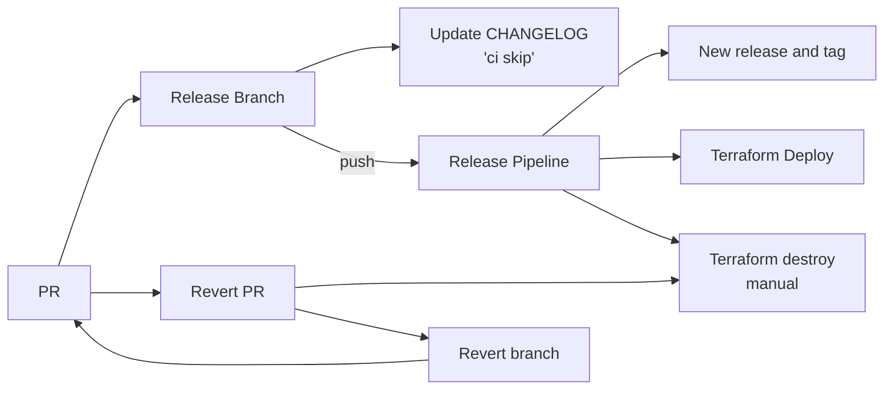

# Release Revert and Redeploy Strategy

## Overview

Strategy for safely reverting and redeploying releases in DEV and PROD environments, identifying critical gaps and risks.

## Revert Process Flow

### Steps

1. Create Revert PR via GitHub UI: Navigate to problematic PR → Click "Revert" → Target `dev` (or `dev` then `main` for PROD)
2. Revert Branch Created: Review revert includes all problematic commits
3. Merge Revert PR: DEV (1 reviewer) or PROD (merge to `dev`, test, then PR to `main` with 2+ reviewers)
4. Release Pipeline: Creates new release/tag, updates CHANGELOG with `[skip ci]`, deploys reverted code
5. Manual Infrastructure Cleanup ⚠️: GitHub Actions → Run "Terraform Destroy" workflow → Select environment → Verify removal
6. Verification: Test functionality, monitor health (1hr PROD, 30min DEV)

## Critical Gaps & Risks

Gap 1: Manual Terraform Destroy - Orphaned resources, cost waste, security exposure  
Gap 2: No Automated Rollback Triggers - Extended downtime, human error  
Gap 3: Database Migration Reversibility - Irreversible data changes, schema incompatibility  
Gap 4: No Blue-Green/Canary Deployment - All users affected simultaneously

## Key Principles

1. Always flow through `dev` - Never revert directly to `main`
2. Test in DEV first 
3. Manual Terraform cleanup

