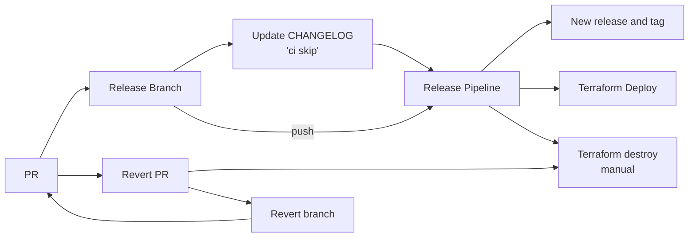

Query:
Existing release process: 
...

Create a documentation to describe the way for safely reverting and redeploying releases in dev prod environments. Identify gaps and risks in existing processes.
A documented strategy outlining the end-to-end revert and redeploy process.

## Release and revert process

Develop release:
